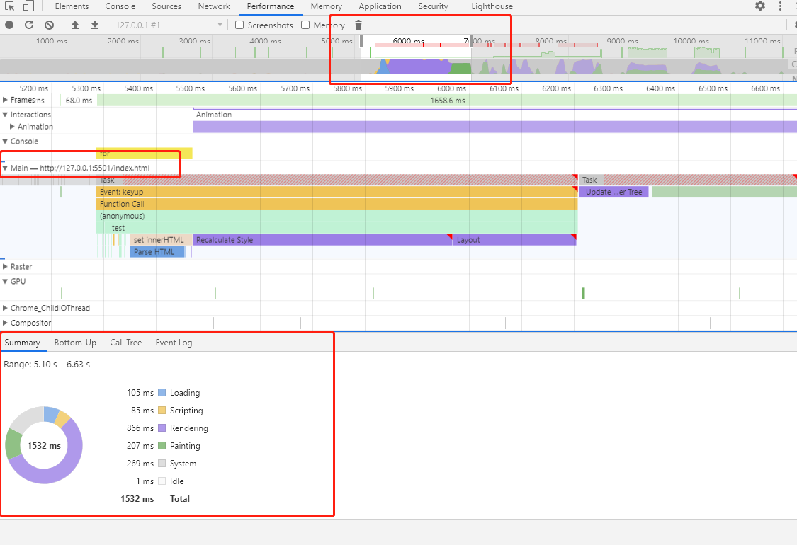
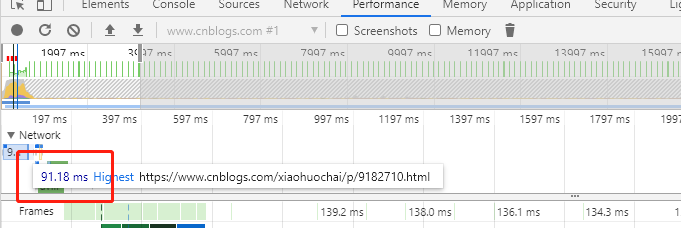
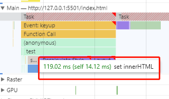
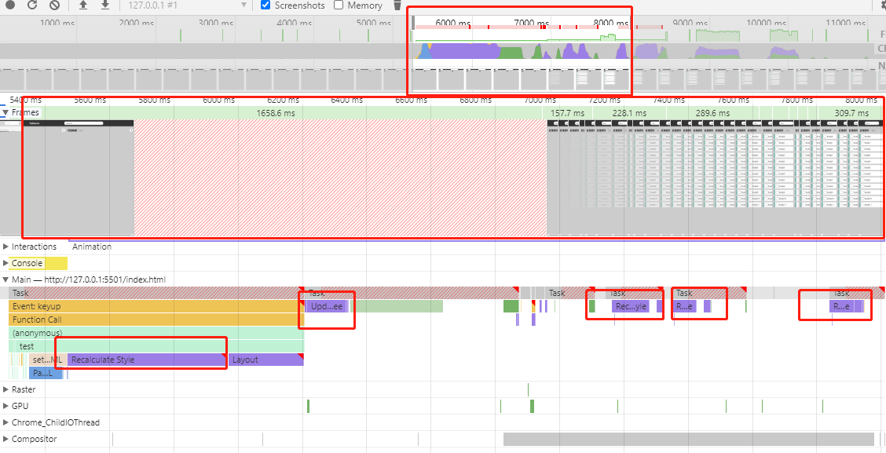
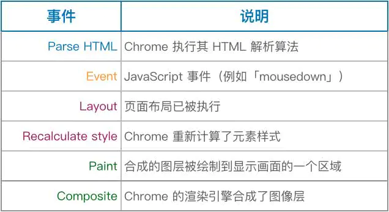
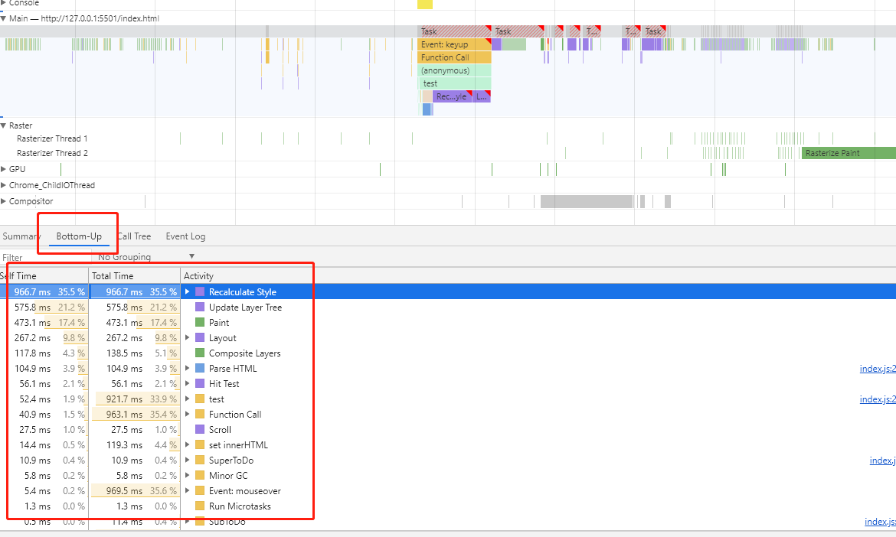
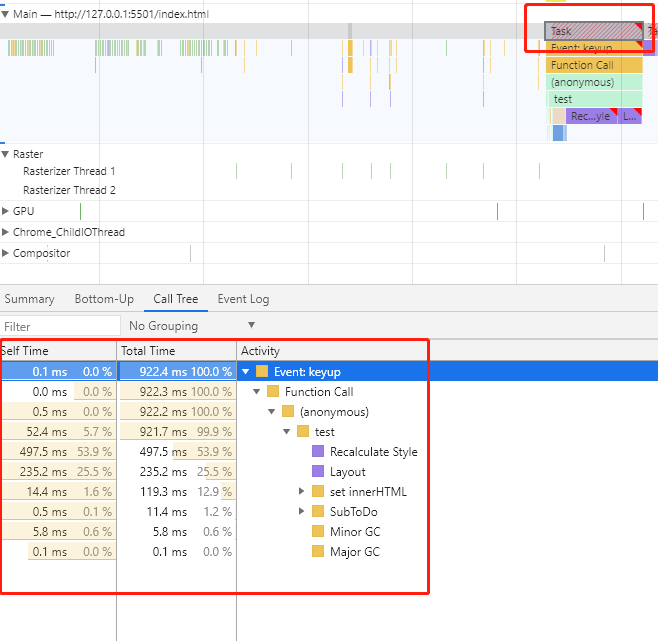
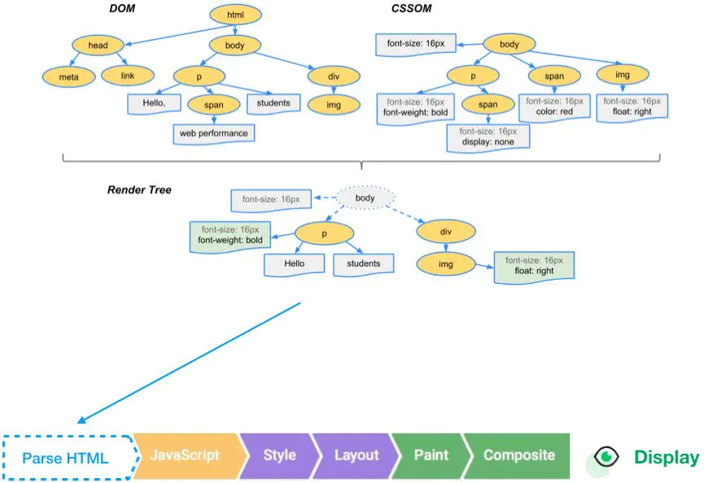

## 目录
<!-- TOC -->

- [目录](#目录)
- [Performance](#performance)
  - [区域一：控制面板](#区域一控制面板)
  - [区域二：概览面板](#区域二概览面板)
    - [FPS](#fps)
    - [CPU](#cpu)
    - [NET](#net)
  - [区域三：线程面板](#区域三线程面板)
    - [Frames](#frames)
    - [Main！！！](#main)
  - [区域四：统计面板](#区域四统计面板)
    - [Summary](#summary)
    - [Bottom-Up](#bottom-up)
    - [Call Tree](#call-tree)
    - [Event Log](#event-log)
- [浏览器渲染过程](#浏览器渲染过程)

<!-- /TOC -->

## Performance

主要分为四个区域：

### 区域一：控制面板

+ `Screenshots`

  截图，默认勾选，每一帧都会截图。

+ `Memory`

  内存消耗记录，勾选后可以看到各种内存消耗曲线

  

+ `Disable JavaScript samples`

  关闭 JavaScript 样本：减少在手机运行时的开销，模拟手机运行时勾选

+ `Network`

  网络模拟：可以模拟在3G / 4G等网络条件下运行页面

+ `Enable advanced paint instrumentation`

  记录渲染事件的细节：？

+ `CPU`

  CPU限制：主要是为了模拟低 CPU 下运行性能

### 区域二：概览面板

可以通过选择一个起始点按住鼠标**左键**滑动来选择面板选中范围

#### FPS

每秒帧数，标准是保持在60FPS

绿色越高越好，出现红色则表示 FPS 低（就会觉得页面卡顿了）

可以在区域三 Frames 中看到具体的 FPS 值

#### CPU

处理各个任务花费的时间，选择一段 CPU 统计，点击区域三的Main，就可以在区域四的 Summary 看到统计表格

+ Loading：加载
+ Scripting：脚本
+ Rendering：渲染
+ Painting：绘制
+ System：？
+ ldel：闲置

比重占的大的颜色可能有问题，如上图中的紫色部分`Rendering`，表示渲染耗费时间久

#### NET

各个请求花费时间

### 区域三：线程面板

#### Frames

帧线程，鼠标悬浮绿色块可以看到fps

#### Main！！！

主线程，负责执行 JavaScript，解析 HTML/CSS，完成绘制。

可以看到主线程**调用栈**和**耗时情况**，每个长条都是一个事件，悬浮可以看到耗时和事件名

1. 最上面的第一条就是事件触发的地方，直到结束，这条线是最长的（Task）。如上图红色表明耗时长

2. 上面的 `event` 调用了下面的子 `event`，越到下面数量越少

   

   可以清楚的看到每个 `event` 耗时的时间，从而可以快速分析是什么 `event` 时间比重大

   如我实习的demo——ToDoList v2.0：

   

   

   

   + 像上面的图一，`set innerHTML`其实消耗时间并不大（而且它还会执行 Prase HTML，在他的下面蓝色那个条条）

   + 而图二的 `Recalculate Style` 耗时要比`set innerHTML`大的多，执行完之后其实函数已经执行完了

   + 剩下的时间就是像图三所示在不断的 `Paint`、`Recalculate Style`了，这里耗时才是最长的（我猜是因为节点多，所以css渲染时间就长）

   + 颜色代表各个时间类型，从网上借用一张图

     
   
3. Raster

   Raster线程，负责完成某个 layer 或者 某个块的绘制（不懂）

### 区域四：统计面板

#### Summary

统计图：展示各个事件阶段消耗的时间

#### Bottom-Up

排序：可以看到各个事件消耗时间排序

1. `self-time` 指除去子事件这个事件本身消耗的时间
2. `total-time` 这个事件从开始到结束消耗的时间（包含子事件）

#### Call Tree

 调用栈：`Main`选择一个事件，可以看到整个事件的调用栈（从最顶层到最底层，而不是只有当前事件）

#### Event Log

事件日志

1. 多了个`start time`，指事件在多少毫秒开始触发的
2. 右边有事件描述信息

## 浏览器渲染过程

参考文章（里面后文还有拓展）：[chrome devtools使用详解——Performance](https://www.jianshu.com/p/d8795ff8e079) 

