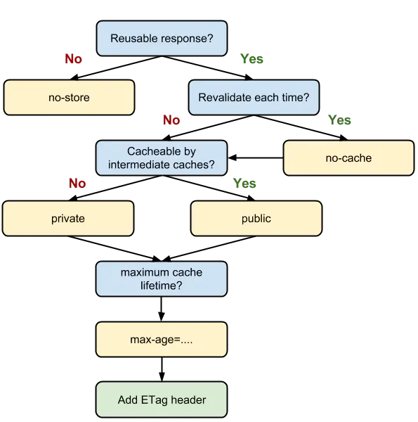

[从输入URL到页面加载的过程？如何由一道题完善自己的前端知识体系！](https://segmentfault.com/a/1190000013662126) 

## 缓存

### 1. 为什么需要缓存

+ 冗余的数据传输（总是传相同的东西）
+ 带宽瓶颈（客户端的宽带比服务器的宽带要宽，访问速度就慢）
+ 瞬间拥塞（有爆炸性新闻）
+ 距离时延（客户端和服务器太远了）

### 2. 缓存的命中和未命中

- 可以用已有的副本为某些到达缓存的请求提供服务,这被称之为缓存命中（就是有可以用的缓存副本）

  

- 其他一些到达缓存的请求可能会由于没有副本可用,而被转发给原始服务器,这被称之为缓存未命中（没有缓存副本，要向服务器要）


### 3. 新鲜度检测规则

#### 1）强缓存

HTTP通过缓存将服务器文档的副本保留一段时间。在这段时间里,都认为文档时新鲜的,缓存可以在不联系服务器的情况下,直接提供该文档。我们称之为**强缓存命中**,此时浏览器会返回200状态码(from cache)


但一旦以缓存副本停留的时间太长,超过了文档的新鲜度限值,就认为文档过期了。


#### 2）协商缓存

在提供文档之前，缓存都要再次与服务器进行再验证，查看文档是否发生变化，我们称之为**协商缓存**。


+ 验证命中：如果服务器对象没有被修改,服务器会向客户端发送一个小的HTTP `304 Not Modeified`响应
+ 验证未命中：如果服务器对象与以缓存副本不同,服务器向客户端送一条普通的带有完整内容的HTTP `200 ok` 响应
+ 对象被删除：如果服务器对象已经被删除了,服务器就回送一个404 Not Found 响应,缓存也会将其副本删除


### 4. 强缓存原理

+ `Cache-Control`（通用首部字段）：控制缓存的行为

  + `max-age`值定义了文档的最大使用期——从第一次生成文档到文档不再新鲜,无法使用为止,最大的合法生存时间(以秒为单位)

  + 缓存请求指令（浏览器的）

    | 指令             | 参数   | 说明                         |
    | ---------------- | ------ | ---------------------------- |
    | no-cache         | 无     | 强制向源服务器再次验证       |
    | no-store         | 无     | 不缓存请求或响应的任何内容   |
    | max-age=[秒]     | 必需   | 响应的最大使用期值           |
    | max-stale(=[秒]) | 可省略 | 接受已过期的响应             |
    | min-fresh=[秒]   | 必需   | 期待在指定时间内的响应仍有效 |
    | no-transform     | 无     | 代理不可更改媒体的类型       |
    | only-if-cached   | 无     | 从缓存获取资源               |
    | cache-extension  | -      | 新指令标记(token)            |

  + 最佳`Cache-Control`策略：

    

    

+ `Expries`（实体首部字段）：实体主体过期的日期时间
  
  + 指定一个绝对的过期日期，由于我们可以去更改客户端的时间，这样就可以改变缓存命中的结果，因此优先使用`Cache-Control`


浏览器第二次发送请求相同资源时，拿出过期日期和当前时间进行比较，如果在过期日期之前，则**强缓存命中**；

如果缓存文档过期，缓存就必须与服务器进行核对，询问文档是否过期，如果被修改过，就要获取一份新鲜（带有新的`Expries`）的副本。


## 浏览器的渲染机制

### 1. 两种内核浏览器的渲染过程

+ **webkit渲染过程**


+ **Gecko渲染过程**


+ 文字版渲染过程：
  1. HTML解析文件，生成DOM Tree；解析CSS文件生成CSSOM Tree
  2. 将DOM Tree和CSSOM Tree结合，生成Render Tree（渲染树）
  3. 根据Render Tree渲染绘制，将像素渲染到屏幕上（其中涉及回流和重绘）
+ 分析：
  1. DOM解析和CSS解析是两个并行的进程，所以CSS加载不会阻塞DOM的解析
  2. Render Tree是依赖于DOM Tree和CSSOM Tree的，所以他必须等到CSSOM Tree构建完成，也就是CSS资源加载完成（或者CSS资源加载失败）后，才能开始渲染。因此，CSS加载是会阻塞DOM的渲染的。
  4. CSS后面如果有js文件，要等CSS加载完之后js文件才会被解析执行，即**CSS加载会阻塞后面js语句的执行** 


### 2. 回流和重绘


> 当网页生成的时候，至少会渲染一次。在用户访问的过程中，还会不断重新渲染。重新渲染会重复上图中的回流（生成布局）+重绘（绘制）或者只有重绘。

+ 重绘：当render tree中的一些元素需要更新属性，而这些属性只是影响元素的**外观、风格**，而不会影响布局的，比如background-color
+ 回流：当render tree中的一部分（或全部）因为元素的**规模尺寸、布局、隐藏**等改变而需要重新构建

**回流必定会发生重绘，重绘不一定会引发回流。**

#### 1）常见引起回流属性和方法

任何会改变元素几何信息（元素的位置和尺寸大小）的操作，都会触发回流。

1. 添加或者删除可见的DOM元素
2. 元素尺寸改变——margin、padding、border、width、height
3. 内容变化，比如用户在input框中输入文字
4. 浏览器窗口尺寸改变——resize事件发生时
5. 计算offsetWidth和offerHeight属性
6. 设置style属性的值

#### 2）常见引起重绘属性和方法


#### 3）代码例子

下面这个例子中，触发了几次回流和重绘

```js
var s = document.body.style;
s.padding = "2px"; // 回流+重绘
s.border = "1px solid red"; // 再一次 回流+重绘
s.color = "blue"; // 再一次重绘
s.backgroundColor = "#ccc"; // 再一次 重绘
s.fontSize = "14px"; // 再一次 回流+重绘
// 添加node，再一次 回流+重绘
document.body.appendChild(document.createTextNode('abc!'));
```

#### 4）如何减少回流、重绘

+ 使用transform代替top

+ 使用visibility替换display: none，前者只会引起重绘（隐藏但占位），后者会引发回流（隐藏并且不占位）（改变了布局）

+ 不要把节点的属性值放在一个循环里当作循环里的变量

  ```js
  for(let i = 0; i < 1000; i++) {
      // 获取 offsetTop 会导致回流，因为需要去获取正确的值
      console.log(document.querySelector('.test').style.offsetTop)
  }
  ```

+ 不要使用table布局

+ CSS选择符从右往左匹配查找，避免节点层级过多

+ 将频繁重绘或者回流的节点设置为图层，图层能够阻止节点的渲染行为影响别的节点。比如对于video标签来说，浏览器会自动将该节点变为图层。


### 3. 提高CSS加载速度的方法

由浏览器的渲染过程可以知道，CSS加载会阻塞DOM的渲染，所以我们应该尽可能的提高CSS加载速度，有以下几种方法：

1. 使用CDN（因为CDN会根据你的网络状况，替你挑选最近的一个具有缓存内容的节点为你提供资源，因此可以减少加载时间）
2. 对CSS进行压缩（可以用很多打包工具，比如webpack、gulp等，也可以通过开启gzip压缩）
3. 合理的使用缓存（设置Cache-Control、Expires，以及ETag，不过要注意一个问题，就是文件更新后，为了避免缓存而带来的影响，其中一个解决防范是在文件名字后面加一个版本号）
4. 减少http请求数，将多个CSS文件合并


### 4. js异步解析的两种属性async和defer的作用和区别

接下来我们对比下 defer 和 async 属性的区别：


其中蓝色线代表JavaScript加载；红色线代表JavaScript执行；绿色线代表 HTML 解析。

#### 1）情况1`<script src="script.js"></script>`

立即加载并执行指定的脚本。

#### 2）情况2`<script async src="script.js"></script>` (异步加载后直接执行)

`aysnc`的script如果已经加载好，就会开始执行——无论此刻是 HTML 解析阶段还是 `DOMContentLoaded` 触发之后。

需要注意的是，这种方式加载的 JavaScript 依然**会阻塞 load 事件**。

换句话说，**`async`的script 可能在 `DOMContentLoaded` 触发之前或之后执行**，但一定在 load 触发之前执行。

#### 3）情况3 `<script defer src="script.js"></script>`(异步加载后延迟执行)

defer 属性表示延迟执行引入的 JavaScript，即这段 JavaScript 加载时 HTML 并未停止解析，**这两个过程是并行的**。

整个 document 解析完毕且 defer-script 也加载完成之后，会执行所有由 defer-script 加载的 JavaScript 代码，然后**触发 `DOMContentLoaded` 事件**。

defer 与相比普通 script，有两点区别：载入 JavaScript 文件时不阻塞 HTML 的解析，执行阶段被放到 HTML 标签解析完成之后。

> 在加载多个JS脚本的时候，async是无顺序的加载，而defer是有顺序的加载


## 页面加载的两个事件

### 1. `DOMContentLoaded`

> 当初始的 **HTML** 文档被完全加载和解析完成之后（即DOM加载完成），**`DOMContentLoaded`** 事件被触发，而无需等待样式表、图像和子框架的完全加载。

**注意：**`DOMContentLoaded` 事件必须等待其所属script之前的样式表加载解析完成才会触发。

```html
<link rel="stylesheet" href="css.php">
<script>
document.addEventListener('DOMContentLoaded',function(){
    console.log('3 seconds passed');
});
</script>
```

如果将link置于script之后，就会立即打印。

[DOMContentLoaded](https://developer.mozilla.org/zh-CN/docs/Web/Events/DOMContentLoaded)


### 2. `load`

> 当整个页面及所有依赖资源如样式表和图片都已完成加载时，将触发`load`事件。

+ 它与[`DOMContentLoaded`](https://developer.mozilla.org/zh-CN/docs/Web/API/Document/DOMContentLoaded_event)不同，后者只要页面DOM加载完成就触发，无需等待依赖资源的加载。

```js
window.addEventListener('load', (event) => {
  console.log('page is fully loaded');
});
```

```js
window.onload = (event) => {
  console.log('page is fully loaded');
};
```


## HTTP状态码

2xx：请求被正常处理了

| 状态码 | 状态码英文名称  | 中文描述                              |
| ------ | --------------- | ------------------------------------- |
| 200    | OK              | 请求成功                              |
| 202    | Accepted        | 服务器已经接受请求，但未处理完成      |
| 204    | No Content      | 请求成功，但未返回内容。              |
| 206    | Partial Content | 部分内容。服务器成功处理了部分GET请求 |

3xx：重定向

| 状态码 | 状态码英文名称    | 中文描述                                              |
| ------ | ----------------- | ----------------------------------------------------- |
| 301    | Moved Permanently | 永久重定向。请求的资源已被永久的移动到新URL。         |
| 302    | Found             | 临时重定向。请求的资源还在，但暂时需要另一个URL访问。 |
| 304    | Not Modified      | 缓存重定向，表示资源未修改，重定向已存在的缓存文件。  |

> 301和302的响应里，响应头使用Location字段，指明后续哟啊跳转的URL，浏览器会自动定向到新URL。

4xx：客户端错误

| 状态码 | 状态码英文名称 | 中文描述                               |
| ------ | -------------- | -------------------------------------- |
| 400    | Bad Request    | 客户端请求的语法错误，服务器无法理解。 |
| 403    | Forbidden      | 客户端的请求被拒绝                     |
| 404    | Not Found      | 请求的资源不存在或者未找到             |

5xx：服务器错误

| 状态码 | 状态码英文名称        | 中文描述                                                     |
| ------ | --------------------- | ------------------------------------------------------------ |
| 500    | Internal Server Error | 服务器内部错误，无法完成请求                                 |
| 501    | Not Implemented       | 服务器暂不支持客户端请求的功能                               |
| 502    | Bad Gateway           | 作为网关或者代理工作的服务器尝试执行请求时，从远程服务器接受到了一个无效的响应 |
| 503    | Service Unavailable   | 由于超载或系统维护，服务器暂时无法处理客户端的请求           |
| 504    | Gateway Time-out      | 充当网关或代理的服务器，未及时从远端服务器获取请求           |


